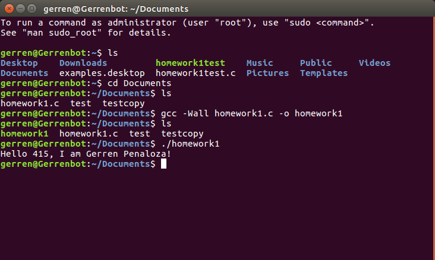

# Homework 1

## Overview 
This is a simple program that outputs a string. The string is a greeting message that includes the
name of a student. The name of the student is a defined constant that can be changed at any time.
It requires a buffer, snprintf() which writes a string to the buffer, and the write() system call
which outputs the buffer. On success, it will print out the message “Hello 415, I am 'name'!”
where 'name' is the defined constant that contains the student’s name.

## Testing 
For testing, I changed the defined constant to another person’s name and recalculated the total
number of bytes being used so I knew how many bytes to enter for the third argument in the
write() system call. I also entered in less bytes than I needed to for the write() system call just to
see if it would cut the string that I passed into the buffer short, which it did.

