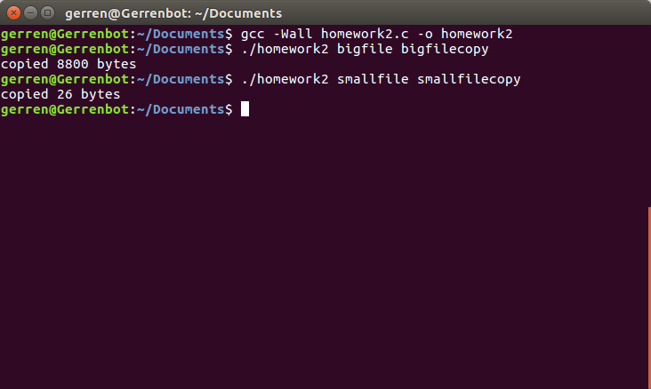

# Homework 2

## Overview 
This program mimics the cp command on UNIX. You pass in exactly two arguments when you
run the executable. The first argument is the name of the file that you will copy the contents
from. The second argument is the name of the new file you want to write the copied contents of
the first argument into. The program will be checking for error cases each time it runs a system
call. For example, if the file corresponding to the first argument you passed in does not exist an
error message will pop up. More importantly, this program prevents you from overwriting an
existing file. If there is a pre-existing file that matches the name of the second argument you pass
into the program, the new file will not be created and an error message is outputted on the
terminal. The bytes are copied from one file to another in 1KB blocks using a while loop that
reads the bytes from the original file and then writes them to the new file. There are conditions in
the while loop that check for errors when calling read() as well as an error for “short write”.
“Short write” occurs when the amount of bytes written to the new file does not equal the number
of bytes that was read from the original file. Lastly, program closes the two files and checks for
errors when calling the close() system call. If the program runs successfully, a message pops up
on the terminal that tells you how many bytes were copied to the new file. Errors are reported to
stderr.

## Testing 
The first thing I did to test the program was to try and test if the errors would report correctly.
For example, I tried to pass in arguments for files that did not exist for the first argument to make
sure the open() error would output to the screen. I also tried to overwrite existing files by
entering pre-existing file names into the second argument. Once I was sure the error messages
were checking in the right places I ran the program on a file that was bigger than 1024 as well as
on a file that was significantly less than 1024 bytes. I checked the new files that were created
each time and they seemed to be identical to the original.

