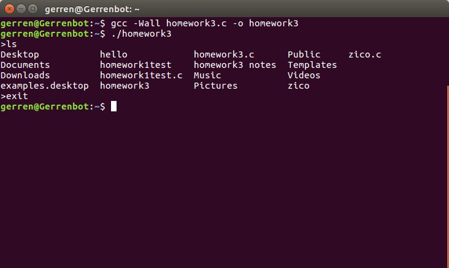

# Homework 3

## Overview 
This program is a shell that runs on top of your shell. It is meant to execute UNIX commands
with a maximum of 4 arguments. The user does not pass in any arguments to the program
through the command line. Once the program is running, the mock shell begins and waits for
the user to enter in a command. The user’s input is stored in a buffer that can hold up to 1024
bytes. The strings in the buffer are tokenized and passed into another buffer using white space
as a delimiter. In order to keep the mock shell as close to our command line as possible we call
fork() before we execute each UNIX command. Once fork() is called we use execvp() to execute
the UNIX command. The arguments being passed to execvp are the first element of the buffer
we stored the tokens in as well as the buffer itself. We call wait() so that the program waits for
the child process to complete before trying to execute a new process. The program checks to
see if the user enters “exit”, which causes the mock shell to close and return to the normal
command line. On success, the mock shell should be able to execute any command line
argument you would be able to do on your normal command line.

## Testing 
To test this program I just did simple command line arguments such as pwd, ls, and echo. I used
echo to test if only 4 arguments were being recorded. I typed in “exit” to see if the program
would quit and return me to the normal command line.

