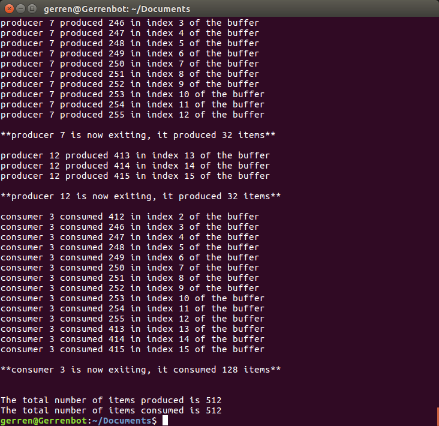

# Homework 5

## Overview 
### For Part 1:
I did not see any differences in the counts of ASCII characters when producing the counts using
synchronization and not using synchronization. The only noticeable difference was that calculating the counts
using a mutex took much longer than it did when I re-wrote the code using a one-dimensional array as opposed to
a two-dimensional array. The time difference makes sense because the threads must now wait a little bit longer to
obtain the lock before they can increment the global array.

### For Part 2:
The purpose of this project was to create a multithreaded solution to the consumer/producer problem
using condition variables as well as a mutex. An int buffer of size 16 is declared globally. This buffer will be treated
as a circular buffer. The buffer is going to be written into by the producer threads and read from by the consumer
threads. A global int will also be keeping track of the size of this buffer as items are being read from and written
into the buffer. A static mutex as well as 2 static condition variables are declared globally. The mutex is used to
prevent race conditions when we are either reading or writing to the buffer. The condition variables
(ready_to_read and ready_to_write) will be used in both the producer thread and consumer thread functions. In
the producer thread function, if a producer thread writes to all of the available spots in the buffer
pthread_cond_wait() is called passing in the ready_to_write condition variable. Each time an item is written to the
buffer by a producer thread, we use pthread_cond_signal() and pass in the ready_to_read variable which wakes up
a consumer thread because there is data available for a consumer thread to read. The concept works very similarly
for the consumer thread function. If a consumer thread reads all of the data in the buffer, pthread_cond_wait() is
called passing in the ready_to_read condition variable. Each time an item is read and printed from the buffer by a
consumer thread, it frees up a spot in the buffer for a producer thread to write into so we use
pthread_cond_signal() and pass in ready_to_write which wakes up a producer thread. The global integers
totalItemsProduced and totalItemsConsumed are used to basically keep track of the grand total of items produced
and consumed. Each time a thread produced or consumed an item these integers are incremented accordingly. If
the program is working properly, these two integers should be the same number by the time all of the threads exit.
The global integer readyIndex is used to keep track of the next index that is available to either read or write to
depending on which thread method it is being used in. Lastly, each thread will have a unique thread ID and a
number of items it is responsible for handling. This information will be managed using structs for each kind of
thread.

In the main the arguments the user passes the command-line parameters and uses shift left logical to
convert them to a power of 2. These values are assigned to integers that represent the number of producer
threads, the number of consumer threads, and the number of items each producer will be producing. Arrays of
structs and pthread arrays are used to keep track of the various consumer and producer threads that are being
used in the program. An output message just tells the user how many producer threads, consumer threads, and
how many items will be produced by each producer thread based on the arguments they passed into the
command line. The rest of the main is basically just initializing all of the synchronization objects, spawning the
producer and consumer threads and printing the grand total of items produced and consumed.
In the producer thread function, there is a for loop that loops from 0 to the number of items the producer
thread is meant to produce. In the for loop, we lock the mutex to prevent a race condition when numbers are
being written into the buffer. First, an available index is calculated, then an item is written to that calculated index.A local variable counter keeps track of how many items the current producer thread has added into the buffer is
incremented. The size of the buffer is incremented as well, along with the global integer keeping track of the grand
total of items produced. The mutex is then unlocked. The for loop continues until the producer thread has
produced the correct number of items, then it exits.

In the consumer thread function, there is a for loop that loops from 0 to the number of items the
consumer thread is meant to consume. In the for loop, we again lock the mutex to prevent a race condition when
the items are being read from the buffer. Once an item is consumed it is printed onto the console and the
readyIndex is updated. The purpose of updating the readyIndex is so the consumer thread consumes an element at
a valid index and so the producer threads write into the buffer at a proper index. The local variable counter that
keeps track of how many items the thread has consumed from the buffer is incremented. The global variable that
tracks the grand total of items consumed is also incremented. The global variable keeping track of the size of the
buffer is decremented because once the item is read from the buffer, space frees up to write into the buffer. The
mutex is then unlocked and a signal is sent to alert any waiting producer threads that space has been freed up in
the buffer. The consumer thread exits once it has consumed the correct number of items.

On success, print statements will be printed onto the console that track which producer thread is writing
to which index on the buffer and which consumer thread is consuming which item in the buffer. Print statements
for when a producer or consumer thread exit and how many items they produced/consumed will also be printed.
The last two lines will be the grand total of items produced and consumed, if the program functioned correctly,
these numbers should be the same number.

## Testing 
To test the program I passed in different values for the producers and consumers, but kept the items being
produced at a constant 32. The tests were for 1 producer/2 consumers, 2 producers/1 consumer, 2 producers/4
consumers, and 4 producers/2 consumers.

