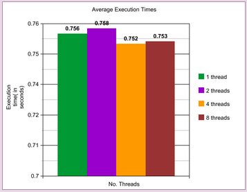
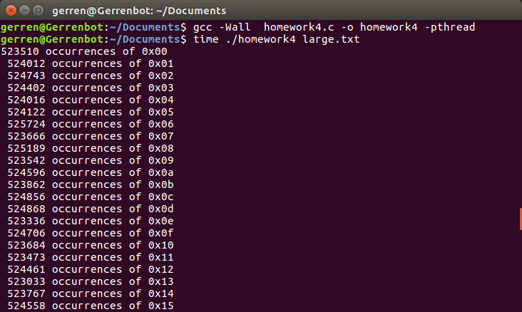

# Homework 4

## Overview 
The purpose of this program was to create a multithreaded ASCII character counter. We were provided
with a ASCII text file called “large.txt” which we read into a 64MB buffer in global memory. Once the file
is read into the buffer we partition the buffer based on how many threads we use in the program. The
partitions need to be roughly equal in size, so the size of the partition is just the number of bytes in the
buffer divided by the number of threads. Next, we create an array of threads whose size is the number
of threads being used in the program. Each thread needed a thread index and a partition bound, which
are passed to the thread using a struct in global memory. Using a for loop, we spawn the threads one by
one. Inside the for loop, using pthread_create(), a thread is passed to the void *characterCounter
function. In void *characterCounter, we’re just examining the partition each thread is responsible for
counting the ASCII characters for one character at a time. There is a 2-D array, int threadCounts[][], in
global memory that is responsible for storing the occurrences of each individual ASCII character that
each thread counts. Once void *charCounter finishes, the occurrences of each ASCII character found in
the partition that the thread being passed into void *charCounter was responsible for are updated in the
2-D array int threadCounts[][]. The last step in the program is adding up the grand total of occurrences
of each ASCII character found by the threads. This is done with another for loop that loops through the
2-D array. A variable, int chTotal, stores the grand total for each ASCII character found in all the threads
and is reset to 0 after each iteration. On success, the grand total is printed out along with either the hex
code or the actual ASCII character depending on the the ASCII character was a printable or non-printable
character.

## Testing 
To test the program I created my own text file that was a lot smaller than the text file we were given. I
typed in some characters and kept track of the occurrences of the characters in the text file. I passed my
text file into the program using the command line and checked to see if the correct number of
occurrences was recorded.

## Statistics 
These were the statistics I recorded for my program using the “time” UNIX command and recording the
execution time of each run using 1, 2, 4, and 8 threads. The testing platform I was using to run this
program has 4 CPU cores. The speed up observed seemed to be linear.

Using 1 thread:
- 0m0.786s
- 0m0.763s0m0.744s
- 0m0.755s
- 0m0.732s

AVERAGE: 0.756s

Using 2 threads:
- 0m0.776s
- 0m0.769s
- 0m0.733s
- 0m0.739s
- 0m0.774s

AVERAGE: 0.758s

Using 4 threads:
- 0m0.820s
- 0m0.735s
- 0m0.732s
- 0m0.746s
- 0m0.727s

AVERAGE: 0.752s

Using 8 threads:
- 0m0.728s
- 0m0.688s
- 0m0.760s
- 0m0.829s
- 0m0.758s

AVERAGE: 0.753s

